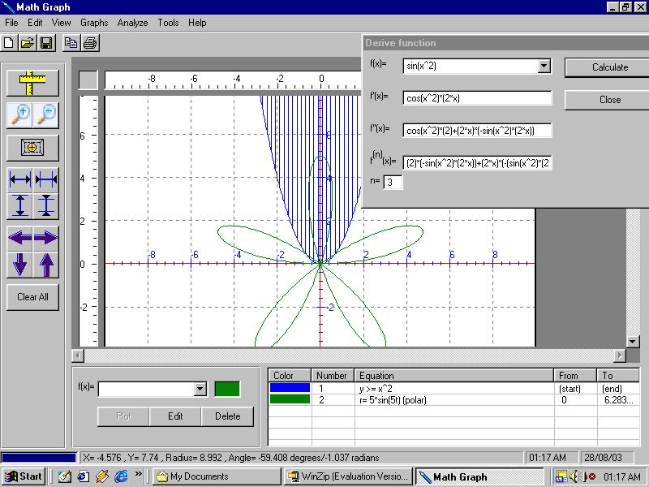



## Math Graph 2\.0: Advanced graph plotter/function analyzer \*\*\*UPDATED  21\-August\-2005\*\*\*

### Description

Math Graph is a program that graphs many equations and analyzes functions, it has the following features:

1. Graphing Y(x)/X(y) functions, Parametric functions, Polar functions, and Implicit relations, as well as graphing cartesian Inequalities.

2. Deriving functions symbolically.

3. Analyzing a function(Get value at a point, Calculate limit, Area under curve, Extrema and Inflection points, Draw Tangent/Normal to curve...).

4. Adding, deleting and editing a graph.

5. Customizing the Axis and Grid colors and appearance.

6. Solving single variable equations.

7. Several zooming and scrolling functions including zoom-box.

And more...
 
### More Info
 

             |
---                |---
**Submitted On**   |2003-08-31 21:07:50
**By**             |[sohaib farsakh](https://github.com/Planet-Source-Code/PSCIndex/blob/master/ByAuthor/sohaib-farsakh.md)
**Level**          |Advanced
**User Rating**    |4.9 (64 globes from 13 users)
**Compatibility**  |VB 6\.0
**Category**       |[Math/ Dates](https://github.com/Planet-Source-Code/PSCIndex/blob/master/ByCategory/math-dates__1-37.md)
**World**          |[Visual Basic](https://github.com/Planet-Source-Code/PSCIndex/blob/master/ByWorld/visual-basic.md)
**Archive File**   |[Math\_Graph1927138252005\.zip](https://github.com/Planet-Source-Code/sohaib-farsakh-math-graph-2-0-advanced-graph-plotter-function-analyzer-updated-21-august-2__1-62256/archive/master.zip)

